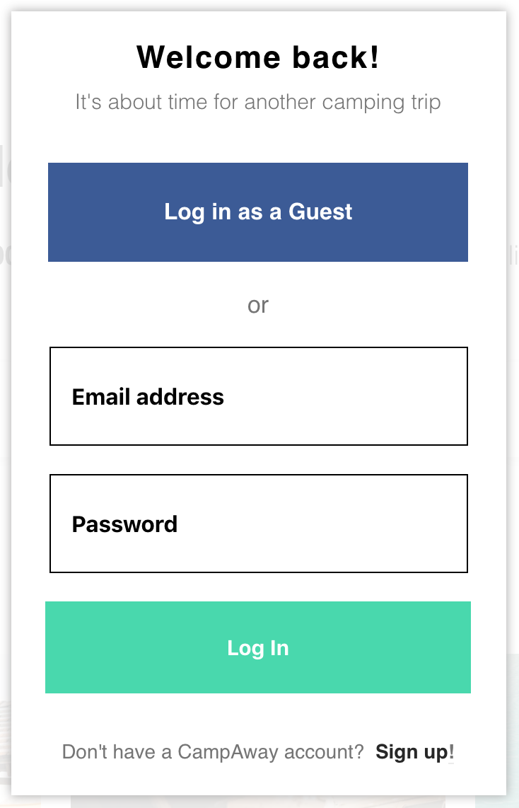

# CampAway
CampAway is a full-stack clone of Hipcamp, which is a site to browse and book camping grounds.

You can visit CampAway [here](https://camp-away.herokuapp.com/#/)!

## Features

### User Auth
Users are able to create accounts, login and logout using the authentication system, which was created using BCrypty on a rails backend. Users can also login as a demo user so that they can easily browse the site.

 

### Host a Spot
Users are able to create their own camping ground by filling out a form. The form was rendered using React and gives the impression of being 3 pages, where it is actually one component. This effect was achieved by using React fragment. Users can choose from various camp features to illustrate what their spot offers. Once a user has created a spot, they are then able to delete it as well.

 

 
### Filter Spots
Users can filter through the spot locations by selecting from a list of categories, including: price, group size and amenities. Once a user has made a selection, they can make more selections. After each choice is made, the spot index is automatically updated to reflected the selected filters. Users may also clear all filters.

## Future Plans
In the future, I hope to add more features, including: user profile, search bar filtering. I also have plans to improve the review section, by allowing users to post photos along with their comments.

